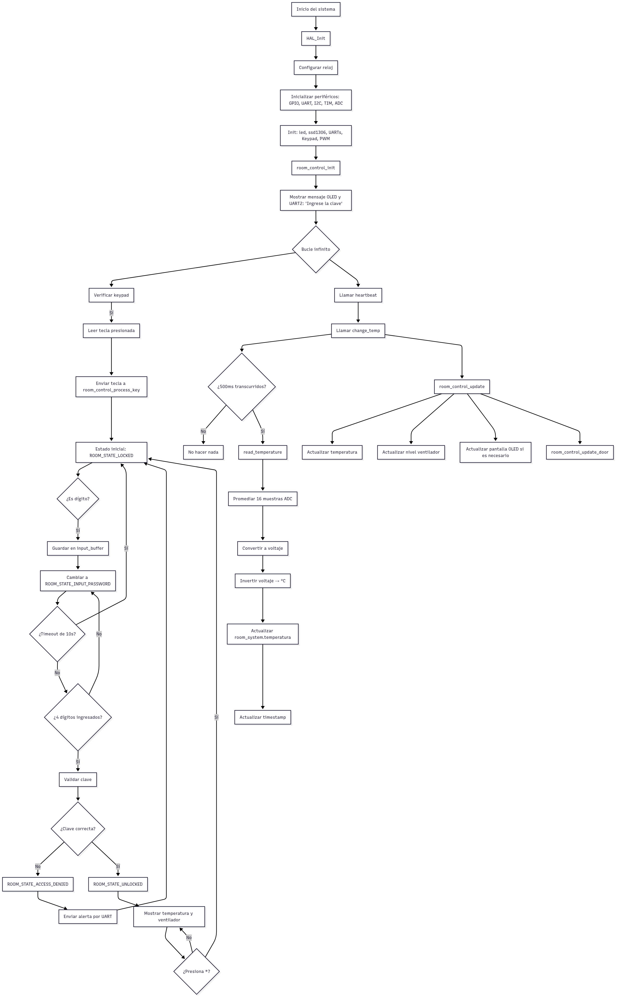

# Control de Acceso Inteligente para Habitación


## Descripción del Proyecto

Este proyecto implementa un sistema embebido para el control de acceso y ventilación de una habitación utilizando un microcontrolador STM32. El sistema gestiona el acceso mediante un teclado y una pantalla OLED, validando una contraseña y controlando un ventilador con PWM basado en temperatura. Además, ofrece un modo de emergencia y control automático del ventilador

---

## Funcionalidades Implementadas

- Ingreso de contraseña desde un teclado matricial
- Control de acceso (bloqueo/desbloqueo de puerta)
- Visualización en pantalla OLED (clave, mensajes de estado)
- Control automático del ventilador por temperatura
- Control PWM del ventilador con distintos niveles (OFF, LOW, MED, HIGH)
- Cambio automático de estados según temporizadores o entradas
- Retroalimentación visual mediante asteriscos en pantalla al ingresar contraseña
- Comandos remootos por via WIFI

---

## Instrucciones de Compilación y Uso

1. *Entorno Requerido:*
   - STM32CubeIDE o VSCode
   - Bibliotecas de drivers

2. *Conexiones:*
   - Teclado matricial a pines GPIO configurados como entradas/salidas
   - Pantalla OLED vía I2C
   - Ventilador conectado a pin PWM (TIM3_CH1)
   - Sensor de temperatura (Pin ADC_IN5)

3. *Pasos para Ejecutar:*
   - Abre el proyecto en STM32CubeIDE
   - Compila y flashea el código a la placa Nucleo 
   - Verifica conexiones con los pines
   - Interactúa con el sistema desde el teclado
4. *Funcionamineto General*
   

---

## Decisiones de Diseño y Explicaciones de Código
---

### Sistema de control de estados (room_control.c)

```c
void room_control_update(room_control_t *room) {
    uint32_t current_time = HAL_GetTick();

    switch (room->current_state) {
        case ROOM_STATE_LOCKED:
            // Mostrar mensaje y asegurar puerta cerrada
            room->door_locked = true;
            // Espera a que se presione una tecla (se maneja en process_key)
            break;

        case ROOM_STATE_INPUT_PASSWORD:
            // Timeout: volver a LOCKED si no hay input en 10s
            if (current_time - room->last_input_time > INPUT_TIMEOUT_MS) {
                room_control_change_state(room, ROOM_STATE_LOCKED);
            }
            break;

        case ROOM_STATE_UNLOCKED:
            // Puerta abierta, LED encendido (puedes agregar aquí si tienes LED)
            room->door_locked = false;
            // Permitir comandos manuales (opcional)
            break;

        case ROOM_STATE_ACCESS_DENIED:
            // Esperar 3 segundos y volver a LOCKED
            if (current_time - room->state_enter_time > ACCESS_DENIED_TIMEOUT_MS) {
                room_control_change_state(room, ROOM_STATE_LOCKED);
            }
            break;

        case ROOM_STATE_EMERGENCY:
            // Lógica de emergencia (opcional)
            break;
    }

    room_control_update_door(room);
    room_control_update_fan(room);

    if (room->display_update_needed) {
        room_control_update_display(room);
        room->display_update_needed = false;
    }
```


| Elemento                        | Función                                   |
| ------------------------------- | ----------------------------------------- |
| HAL_GetTick()                 | Mide el tiempo para gestionar timeouts    |
| switch (room->current_state)  | Ejecuta lógica según estado               |
| room_control_update_door()    | Controla mecanismo físico de la puerta    |
| room_control_update_fan()     | Controla velocidad del ventilador por PWM |
| room_control_update_display() | Actualiza interfaz visual (pantalla OLED) |

### Manejo de entrada de teclado en funcion del estado del sistema. (Interaccion con el dispositivo)
```c
void room_control_process_key(room_control_t *room, char key) {
    room->last_input_time = HAL_GetTick();

    switch (room->current_state) {
        case ROOM_STATE_LOCKED:
            // Iniciar ingreso de contraseña
            room_control_clear_input(room);
            if (room->input_index < PASSWORD_LENGTH && key >= '0' && key <= '9') {
                room->input_buffer[room->input_index++] = key;
                room_control_change_state(room, ROOM_STATE_INPUT_PASSWORD);
            }
            break;

        case ROOM_STATE_INPUT_PASSWORD:
            if (key >= '0' && key <= '9' && room->input_index < PASSWORD_LENGTH) {
                room->input_buffer[room->input_index++] = key;
            }
            // Si ya se ingresaron 4 dígitos, validar
            if (room->input_index == PASSWORD_LENGTH) {
                if (strncmp(room->input_buffer, room->password, PASSWORD_LENGTH) == 0) {
                    room_control_change_state(room, ROOM_STATE_UNLOCKED);
                } else {
                    room_control_change_state(room, ROOM_STATE_ACCESS_DENIED);
                }
            }
            break;

        case ROOM_STATE_UNLOCKED:
            // Permitir volver a LOCKED con '*'
            if (key == '*') {
                room_control_change_state(room, ROOM_STATE_LOCKED);
            }
            break;

        default:
            break;
    }

    room->display_update_needed = true;
}
```

| Estado Actual    | Acción con la tecla        | Resultado                             |
| ---------------- | -------------------------- | ------------------------------------- |
| LOCKED         | Dígito numérico            | Empieza ingreso de clave              |
| INPUT_PASSWORD | Dígito numérico            | Se almacena y evalúa la clave         |
| INPUT_PASSWORD | Clave completa (4 dígitos) | Cambia a UNLOCKED o ACCESS_DENIED |
| UNLOCKED       | Tecla '*'                | Vuelve a LOCKED                     |
| Otro estado      | Cualquier tecla            | Se ignora                             |

### Actualizar la temperatura actual de la habitacion y ajustar el nivel del ventilador

```c
void room_control_set_temperature(room_control_t *room, float temperature) {
    room->current_temperature = temperature;
    
    // Update fan level automatically if not in manual override
    if (!room->manual_fan_override) {
        fan_level_t new_level = room_control_calculate_fan_level(temperature);
        if (new_level != room->current_fan_level) {
            room->current_fan_level = new_level;
            room->display_update_needed = true;
        }
    }
    room->display_update_needed = true;
}
```

| Paso | Acción                                                 | Condición                              | Resultado                                                        |
| ---- | ------------------------------------------------------ | -------------------------------------- | ---------------------------------------------------------------- |
| 1    | Asignar temperatura actual                             | Siempre                                | room->current_temperature = temperature                        |
| 2    | Verificar modo automático                              | !room->manual_fan_override           | Permite ajuste automático del ventilador                         |
| 3    | Calcular nuevo nivel del ventilador                    | Modo automático                        | new_level = room_control_calculate_fan_level(temperature)      |
| 4    | Comparar con nivel actual y actualizar si es diferente | new_level != room->current_fan_level | Cambia el nivel del ventilador y marca actualización de pantalla |
| 5    | Marcar actualización de pantalla                       | Siempre                                | room->display_update_needed = true                             |

### Ingresar Contraseña
```c
        case ROOM_STATE_INPUT_PASSWORD:
            ssd1306_SetCursor(10, 10);
            ssd1306_WriteString("CLAVE:", Font_7x10, White);
            ssd1306_SetCursor(10, 25);
            // Mostrar asteriscos según input_index
            for (uint8_t i = 0; i < room->input_index; i++) {
                ssd1306_WriteString("*", Font_7x10, White);
            }
            break;
```

| Paso | Acción                                   | Función utilizada                    | Resultado                                                       |
| ---- | ---------------------------------------- | ------------------------------------ | --------------------------------------------------------------- |
| 1    | Posicionar cursor para título            | ssd1306_SetCursor(10, 10)          | Cursor se posiciona en la parte superior de la pantalla         |
| 2    | Mostrar texto "CLAVE:"                   | ssd1306_WriteString("CLAVE:", ...) | Instrucción para el usuario de que debe ingresar una contraseña |
| 3    | Posicionar cursor para los asteriscos    | ssd1306_SetCursor(10, 25)          | Cursor baja a una nueva línea para mostrar la entrada           |
| 4    | Mostrar un * por cada dígito ingresado | Bucle con ssd1306_WriteString("*") | Reemplaza cada número ingresado por un asterisco en pantalla    |


### Cambiar el estado del sistema y ejecutar acciones
```c
// Cambia de estado y actualiza LED, mensajes, etc.
static void room_control_change_state(room_control_t *room, room_state_t new_state) {
    room->current_state = new_state;
    room->state_enter_time = HAL_GetTick();
    room->display_update_needed = true;
    
    // State entry actions
    switch (new_state) {
        case ROOM_STATE_LOCKED:
            room->door_locked = true;
            room_control_clear_input(room);
            led_off(&heartbeat_led); // APAGA EL LED, el parpadeo lo hace main.c
            break;
            
        case ROOM_STATE_UNLOCKED:
            room->door_locked = false;
            room->manual_fan_override = false;  // Reset manual override
            led_on(&heartbeat_led); // ENCIENDE EL LED
            break;
            
        case ROOM_STATE_ACCESS_DENIED:
            room_control_clear_input(room);
            led_off(&heartbeat_led); // APAGA EL LED

            char alert_msg[] = "POST /alert HTTP/1.1\r\n"
                               "Host: mi-servidor.com\r\n"
                               "\r\nAcceso denegado detectado\r\n";
            HAL_UART_Transmit(&huart3, (uint8_t*)alert_msg, strlen(alert_msg), 1000);
            break;
            
        default:
            break;
    }
}
```
| Línea de Código                           | Acción                                                               |
| ----------------------------------------- | -------------------------------------------------------------------- |
| `room->current_state = new_state;`        | Cambia el estado actual del sistema                                  |
| `room->state_enter_time = HAL_GetTick();` | Guarda el tiempo en que se cambió de estado (en ms desde arranque)   |
| `room->display_update_needed = true;`     | Marca que el display debe actualizarse                               |
| `room_control_clear_input(room);`         | Limpia el buffer de entrada (ej. teclado)                            |
| `led_off(&heartbeat_led); / led_on(...)`  | Controla el LED indicador según el estado                            |
| `room->door_locked = true/false;`         | Bloquea o desbloquea la puerta                                       |
| `room->manual_fan_override = false;`      | Desactiva control manual del ventilador al desbloquear               |
| `HAL_UART_Transmit(...)`                  | Envía un mensaje HTTP por UART al detectar intento de acceso fallido |

### Mostrar la contraseña en nuevo formato ()
```c
        case ROOM_STATE_INPUT_PASSWORD:
            ssd1306_SetCursor(10, 10);
            ssd1306_WriteString("CLAVE:", Font_7x10, White);
            ssd1306_SetCursor(10, 25);
            // Mostrar asteriscos según input_index
            for (uint8_t i = 0; i < room->input_index; i++) {
                ssd1306_WriteString("*", Font_7x10, White);
            }
            break;
```

| Paso | Acción                                   | Función utilizada                    | Resultado                                                       |
| ---- | ---------------------------------------- | ------------------------------------ | --------------------------------------------------------------- |
| 1    | Posicionar cursor para título            | ssd1306_SetCursor(10, 10)          | Cursor se posiciona en la parte superior de la pantalla         |
| 2    | Mostrar texto "CLAVE:"                   | ssd1306_WriteString("CLAVE:", ...) | Instrucción para el usuario de que debe ingresar una contraseña |
| 3    | Posicionar cursor para los asteriscos    | ssd1306_SetCursor(10, 25)          | Cursor baja a una nueva línea para mostrar la entrada           |
| 4    | Mostrar un * por cada dígito ingresado | Bucle con ssd1306_WriteString("*") | Reemplaza cada número ingresado por un asterisco en pantalla    |

### Control automatico con PWM del ventilador en funcion de la temperatura.
```c
// Control del ventilador usando PWM
static void room_control_update_fan(room_control_t *room) {
    char msg[32];
    uint32_t pwm_value = 0;

    switch (room->current_fan_level) {
        case FAN_LEVEL_OFF:
            pwm_value = 0;
            break;
        case FAN_LEVEL_LOW:
            pwm_value = 30;  // directo, 30%
            break;
        case FAN_LEVEL_MED:
            pwm_value = 70;  // directo, 70%
            break;
        case FAN_LEVEL_HIGH:
            pwm_value = 99;  // 100%
            break;
        default:
            snprintf(msg, sizeof(msg), "Invalid fan level: %d\r\n", room->current_fan_level);
            HAL_UART_Transmit(&huart2, (uint8_t*)msg, strlen(msg), 100);
            return;
    }
    __HAL_TIM_SET_COMPARE(&htim3, TIM_CHANNEL_1, pwm_value);
}
```
| Línea de Código                                            | Acción                                                          |
| ---------------------------------------------------------- | --------------------------------------------------------------- |
| `switch (room->current_fan_level)`                         | Determina el nivel de velocidad del ventilador                  |
| `pwm_value = 0 / 30 / 70 / 99;`                            | Asigna duty cycle del PWM según nivel: OFF/BAJO/MEDIO/ALTO      |
| `__HAL_TIM_SET_COMPARE(&htim3, TIM_CHANNEL_1, pwm_value);` | Actualiza la señal PWM para controlar el ventilador             |
| `snprintf(...) + HAL_UART_Transmit(...)`                   | Envía un mensaje de error si el nivel de ventilador es inválido |


## main.c
### Inicializacion de funciones

ADC1, pin analogico para el sensor, en este caso un sensor analogico LM35
```c
static void MX_ADC1_Init(void);
```

Sistema de control de habitacion:
```c
room_control_init(&room_system);
```
PWM, generar señal
```c
HAL_TIM_PWM_Start(&htim3, TIM_CHANNEL_1);
```

### Leer teclado y actualizar las maquina de estado:
```c
    room_control_update(&room_system);
        // Procesa teclas del keypad
    if (keypad_interrupt_pin != 0) {
      char key = keypad_scan(&keypad, keypad_interrupt_pin);
      if (key != '\0') {
        room_control_process_key(&room_system, key);
      }
      keypad_interrupt_pin = 0;
    }
```

| Línea / Bloque de Código                       | Propósito                                                               |
| ---------------------------------------------- | ----------------------------------------------------------------------- |
| room_control_update(&room_system);           | Ejecuta la lógica de la *máquina de estados* (según tiempo y estado)  |
| if (keypad_interrupt_pin != 0)               | Comprueba si *se presionó una tecla*                                  |
| keypad_scan(...)                             | Identifica *qué tecla fue presionada*                                 |
| if (key != '\0')                             | Verifica que la tecla es válida                                         |
| room_control_process_key(&room_system, key); | Procesa la tecla en el contexto del estado actual (ej. clave, comandos) |
| keypad_interrupt_pin = 0;                    | Limpia el pin de interrupción para permitir nuevas entradas             |

### Leer temperatura desde sensor LM35 con filtrado por promedio
```c
// Función que lee el sensor LM35 conectado al ADC
float read_temperature(void) {
    const int NUM_SAMPLES = 16;
    uint32_t adc_sum = 0;

    // Toma 16 muestras para hacer un promedio y filtrar ruido
    for (int i = 0; i < NUM_SAMPLES; ++i) {
        HAL_ADC_Start(&hadc1);
        if (HAL_ADC_PollForConversion(&hadc1, 10) == HAL_OK) {
            adc_sum += HAL_ADC_GetValue(&hadc1);
        }
        HAL_ADC_Stop(&hadc1);
    }

    // Se convierte la lectura promedio a voltaje y luego a temperatura
    float adc_avg = adc_sum / (float)NUM_SAMPLES;
    float voltage = (adc_avg * 3.3f) / 4095.0f;

    // Inversión forzada
    float inverted_voltage = 0.5f - voltage; // Ajusta el offset según tu sensor

    return inverted_voltage * 100.0f; // LM35 da 10mV por °C → 1V = 100°C
}
```
| Línea de Código                           | Acción                                                            |
| ----------------------------------------- | ----------------------------------------------------------------- |
| `const int NUM_SAMPLES = 16;`             | Define cuántas muestras ADC se tomarán para filtrar el ruido      |
| `adc_sum += HAL_ADC_GetValue(&hadc1);`    | Suma cada lectura ADC al acumulador total                         |
| `HAL_ADC_PollForConversion(&hadc1, 10)`   | Espera hasta 10 ms por cada conversión del ADC                    |
| `adc_avg = adc_sum / (float)NUM_SAMPLES;` | Calcula el promedio de las muestras ADC                           |
| `voltage = (adc_avg * 3.3f) / 4095.0f;`   | Convierte el valor promedio a voltaje entre 0 y 3.3 V             |
| `inverted_voltage = 0.5f - voltage;`      | Corrige el voltaje si el sensor está montado al revés o invertido |
| `return inverted_voltage * 100.0f;`       | Convierte el voltaje en °C usando la escala 10 mV/°C del LM35     |

```c
// Llamado periódico para actualizar la temperatura cada 2 segundos
void heartbeat_temp(void) {
    static uint32_t last_read_time = 0;
    uint32_t now = HAL_GetTick();

    if (now - last_read_time >= 2000) { 
        float temperature = read_temperature();
        room_control_set_temperature(&room_system, temperature);
        last_read_time = now;
    }
}
```
| Línea de Código                                            | Acción                                                                       |
| ---------------------------------------------------------- | ---------------------------------------------------------------------------- |
| `static uint32_t last_read_time = 0;`                      | Guarda el último momento en que se leyó la temperatura                       |
| `uint32_t now = HAL_GetTick();`                            | Obtiene el tiempo actual en milisegundos desde que se inició el sistema      |
| `if (now - last_read_time >= 2000)`                        | Verifica si han pasado al menos 2000 ms (2 segundos) desde la última lectura |
| `float temperature = read_temperature();`                  | Llama la función para obtener la temperatura filtrada del LM35               |
| `room_control_set_temperature(&room_system, temperature);` | Actualiza el valor en el sistema principal (`room_system`)                   |
| `last_read_time = now;`                                    | Actualiza el tiempo de última lectura para la próxima ejecución              |

## Control remoto via WIFI ESP_01
**Comandos implementados:**
- `GET_TEMP` → Devolver temperatura actual
- `GET_STATUS` → Estado sistema (LOCKED/UNLOCKED, fan level)
- `SET_PASS:XXXX` → Cambiar contraseña
- `FORCE_FAN:N` → Forzar velocidad ventilador (N=0,1,2,3)
  *command_parser.c*
### Comandos via UART
```c
/**
 * @brief Analiza el comando recibido y ejecuta la acción correspondiente.
 * @param cmd Cadena con el comando a interpretar
 * @param source_uart UART desde donde se recibió el comando (para responder por el mismo canal)
 */
static void process_command(const char *cmd, UART_HandleTypeDef *source_uart) {
    if (strncmp(cmd, "GET_TEMP", 8) == 0) {
        int temp = (int)(room_control_get_temperature(&room_system) + 0.5f);
        char msg[32];
        snprintf(msg, sizeof(msg), "TEMP: %d C", temp);
        send_response(source_uart, msg);

    } else if (strncmp(cmd, "GET_STATUS", 10) == 0) {
        room_state_t state = room_control_get_state(&room_system);
        fan_level_t fan = room_control_get_fan_level(&room_system);
        char msg[64];
        snprintf(msg, sizeof(msg), "STATUS: %s, FAN=%d",
                 state == ROOM_STATE_LOCKED ? "LOCKED" :
                 state == ROOM_STATE_UNLOCKED ? "UNLOCKED" :
                 state == ROOM_STATE_UNLOCKED ? "ACCESS_GRANTED" :
                 state == ROOM_STATE_ACCESS_DENIED ? "ACCESS_DENIED" : "UNKNOWN",
                 fan);
        send_response(source_uart, msg);

    } else if (strncmp(cmd, "SET_PASS:", 9) == 0) {
        const char *new_pass = cmd + 9;
        if (strlen(new_pass) == 4) {
            room_control_change_password(&room_system, new_pass);
            send_response(source_uart, "Password changed");
        } else {
            send_response(source_uart, "Invalid password format");
        }

    } else if (strncmp(cmd, "FORCE_FAN:", 10) == 0) {
        int level = cmd[10] - '0';
        if (level >= 0 && level <= 3) {
            room_control_force_fan_level(&room_system, (fan_level_t)level);
            send_response(source_uart, "Fan level forced");
        } else {
            send_response(source_uart, "Invalid fan level");
        }

    } else {
        send_response(source_uart, "Unknown command");
    }
}
```
| Comando recibido  | Acción ejecutada                                                                  |
| ----------------- | --------------------------------------------------------------------------------- |
| `GET_TEMP`        | Devuelve la temperatura actual como número entero (`TEMP: 23 C`)                  |
| `GET_STATUS`      | Informa el estado del sistema y el nivel del ventilador (`STATUS: LOCKED, FAN=1`) |
| `SET_PASS:<1234>` | Cambia la contraseña del sistema si tiene exactamente 4 caracteres                |
| `FORCE_FAN:<0-3>` | Fuerza el nivel del ventilador manualmente (`0=OFF`, `3=HIGH`)                    |
| Otro texto        | Devuelve `"Unknown command"`                                                      |

Nota: Todos los comandos son enviados como texto vía UART (ej. desde ESP-01 o consola serial). Las respuestas se devuelven por el mismo canal por el que se recibió el comando.
